<div align="justify">

# Network Security with Snort (IDS/IPS)

In this homelab setup, Snort 2 is running in Network Intrusion Detection System (NIDS) mode on an Ubuntu Server virtual machine (VM). Its primary function is to detect Nmap host discovery and port scanning techniques being used on a Debian VM. Furthermore, tests will be conducted to identify attacks such as SQL injection using tools like WPScan and SQLmap, as well as attempts to create backdoors using the Empire post-exploitation framework and Katana penetration test framework. Snort will also be utilized to detect rogue DHCP and routing attacks, in addition to ICMP Redirect attacks.


## Outline

1. [Procedure](#procedure)
2. [Network Diagram](#network-diagram)
3. [VirtualBox Host-Only Network](#virtualbox-host-only-network)
4. [Scenarios](#scenarios)
	1. [Nmap Scan Detection with Snort](#1---nmap-scan-detection-with-snort)
	2. SQL Injection Detection with Snort
	3. Backdoor Attacks Detection with Snort
	4. Rogue DHCP & Routing Attacks Detection with Snort
	5. ICMP Redirect Attack Detection with Snor


## Procedure

The procedures for building this lab were adapted from [B3l3r0f0nt377](https://www.youtube.com/watch?v=IIBS3aWj99E&list=PLMYaFGbdrr4sFeNeKaiBKFzfIqA1zuAg9&ab_channel=B3l3r0f0nt377) and are detailed below:
- [Virtual machines installation.](https://github.com/robsann/NetworkSecurityWithSnort/blob/main/docs/vms_installation.md)
- [Tools installation and tests procedures.](https://github.com/robsann/NetworkSecurityWithSnort/blob/main/docs/tools_and_tests.md)


## Network Diagram

<div align="center">

</div>

## VirtualBox Host-only Network

The Host-only Network is a virtual network in VirtualBox that is exclusively accessible by the guest virtual machines (VMs) and the host machine running VirtualBox. This network does not provide direct access to the Internet. However, guest VMs can access the Internet by configuring an adapter with Network Address Translation (NAT). In this configuration, the guest VMs will use the IP address 10.0.2.15, while the gateway, DHCP server, and host wil be assigned the IP address 10.0.2.2.

<details>
<summary>
<h3>Virtual Network and IP Addresses</h3>
</summary>


- **Host-only network:** A host-only network, named vboxnet1, has been configured with IP range 192.168.57.0/24. It includes a DHCP Server with IP address 192.168.57.2, providing a dynamic IP range from 192.168.57.3 to 192.168.57.254.
- **Kali Linux address:** The terminal shown at the bottom of the image below displays the host machine's connection to the host-only network (vboxnet1) with the IP address 192.168.57.1.

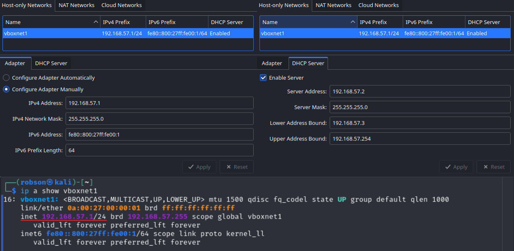<br>

- **Ubuntu Server:** The Ubuntu Server VM was configured with two network adapters. The first adapter (enp0s3) is set to NAT mode and has the IP address of 10.0.2.15, providing internet connectivity. The second adapter (enp0s8) is connected to vboxnet1 with an IP address of 192.168.57.3 and has Promiscuous Mode set to "Allow All".

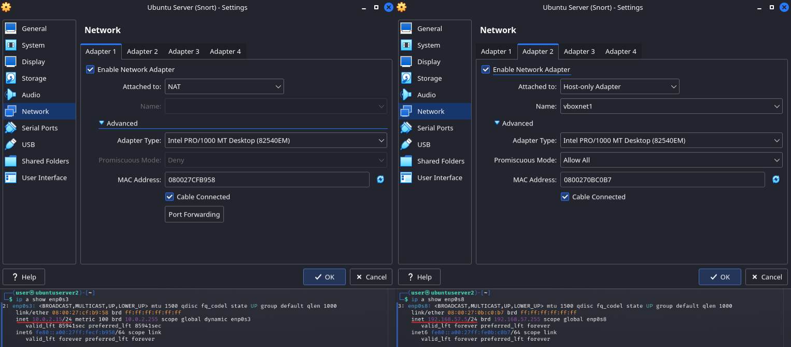<br>

- **Debian:** The Debian VM was also configured with two network adapters. The first adapter (enp0s3) is set to NAT mode and assigned the IP address 10.0.2.15, enabling internet access. The second adapter (enp0s8) is connected to vboxnet1 and has the IP address 192.168.57.4.

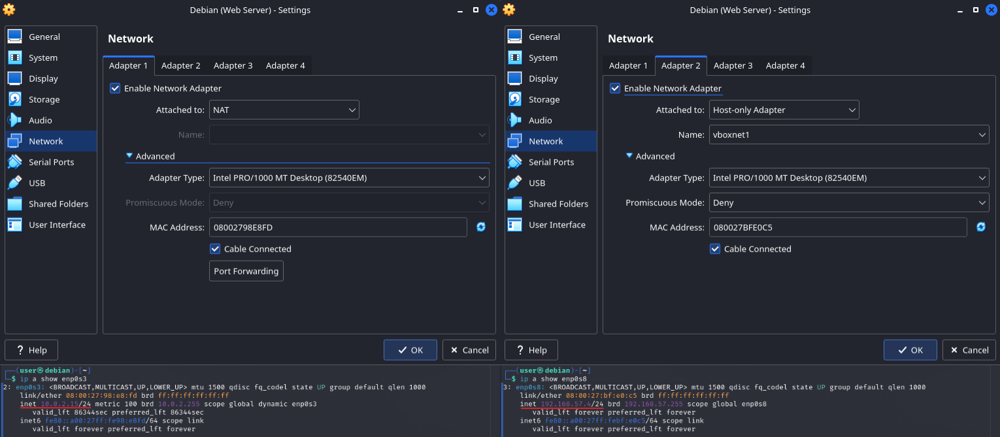

</details>


<h1 align="center" id="scenarios">Scenarios</h1>

## 1 - Nmap Scan Detection with Snort

In this test, host discovery and port scanning were performed using Nmap from the Kali Linux host machine, targeting the Debian virtual machine. Meanwhile, the Ubuntu Server virtual machine detected the Nmap activities through Snort operating in NIDS mode, and packet capture was conducted using Wireshark on the Kali Linux system.

The same Wireshark filter, filtering the Debian IP address, was used for all the tests. The Wireshark filter and the command used to start Snort in NIDS and monitoring mode are in the table below:

The Wireshark filter, which targets the Debian IP address, was applied across all tests. The table below provides details on the Wireshark filter and the command used to initiate Snort in NIDS mode.

<div align="center">

|   					|Command
|-----------------------|-----------------------------------------------------------
|**Wireshark filter**   |`ip.addr == 192.168.57.4`
|**Snort command**      |`sudo snort -A console -c /etc/snort/snort.conf -i enp0s8`

</div>

## 1.1 - Host Discovery

Host discovery was conducted using Kali Linux by employing Nmap's ping scan feature, targeting the Debian virtual machine.

<details>
<summary>
<h3>1.1.1 - Nmap Ping Scan (with privileges)</h3>
</summary>

The host discovery process, executed with the `-sn` flag, involves sending an ICMP echo (ping) request, a TCP SYN to port 443, a TCP ACK to port 80, and an ICMP timestamp request as probe packets. Privileged users scanning targets on a local network have the option to disable ARP or IPv6 Neighbor Discovery (ND) by using the `--disable-arp-ping` flag.

The image below displays the Attack machine executing Nmap (top left) with privileges and with the `-sn` and `--disable-arp-ping` flags and addressing the Target machine. It also shows the packets captured by Snort in the NIDS mode (bottom left) and by Wireshark (right).

#### Nmap command

```bash
sudo nmap -sn --disable-arp-ping 192.168.57.4
```

#### Snort rules

- **ICMP rules**
```yml
alert icmp any any <> 192.168.57.4 any (msg:"ICMP Echo Request";      itype:8;  sid:1000001; rev:1;)
alert icmp any any <> 192.168.57.4 any (msg:"ICMP Echo Reply";        itype:0;  sid:1000002; rev:1;)
alert icmp any any <> 192.168.57.4 any (msg:"ICMP Timestamp Request"; itype:13; sid:1000003; rev:1;)
alert icmp any any <> 192.168.57.4 any (msg:"ICMP Timestamp Reply)";  itype:14; sid:1000004; rev:1;)
```

- **TCP rules**
```yml
alert tcp any any <> 192.168.57.4 any  (msg:"TCP SYN";     flags:S;   sid:11000001; rev:1;)
alert tcp any any <> 192.168.57.4 any  (msg:"TCP SYN/ACK"; flags:SA;  sid:11000002; rev:1;)
alert tcp any any <> 192.168.57.4 any  (msg:"TCP ACK";     flags:A;   sid:11000003; rev:1;)
alert tcp any any <> 192.168.57.4 any  (msg:"TCP RST";     flags:R;   sid:11000004; rev:1;)
```

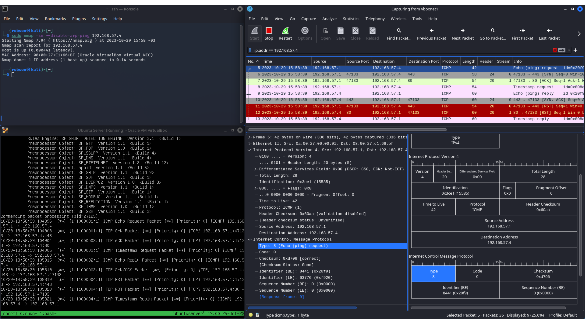
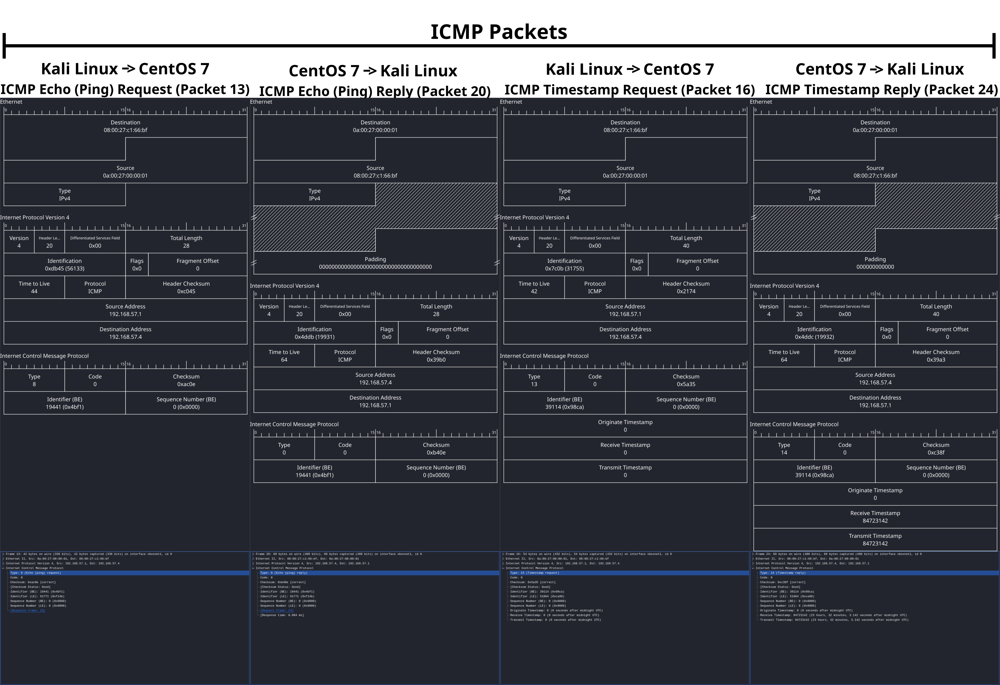
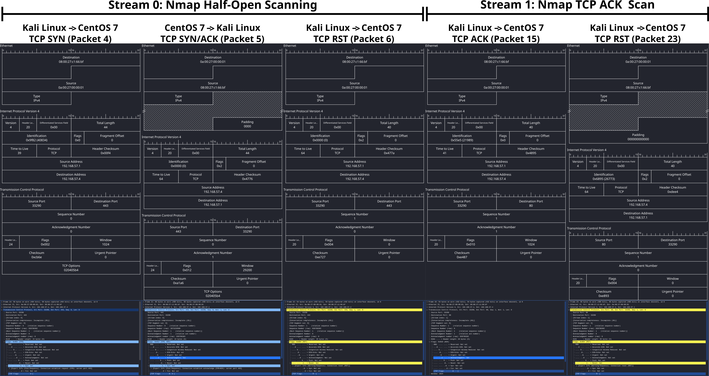

<div align="center">
<small><small>The top image shows the Nmap host discovery scan running with privileges, Snort configured in NIDS mode, and the packets captured using Wireshark. The middle and bottom images display the diagrams of the exchanged ICMP and TCP packets.</small></small>
</div><br>

Snort successfully intercepted the probe packets sent by Nmap: ICMP echo request, ICMP timestamp request, TCP SYN port 443, and TCP ACK port 80, as previously outlined. Additionally, Snort captured the corresponding responses: ICMP echo reply and ICMP timestamp reply for the ICMP packets, a TCP SYN/ACK from the target and a TCP RST from the host for the TCP SYN port 443 packet indicating the port is open, and a TCP RST from the target for the TCP ACK port 80 packet pointing to an unfiltered port. Wireshark also captured the same 4 ICMP packets and 5 TCP packets detected by Snort.

**Nmap Scan Methods**

- **TCP SYN Scan (half-open scanning):** In this scanning method (conducted on port 443), Nmap sends a TCP SYN packet to initiate a connection. The target responds with a TCP SYN/ACK packet to establish the three-way handshake. However, instead of sending a TCP ACK to complete the handshake, the attacker sends a TCP RST packet, terminating the connection abruptly.
- **TCP ACK Scan (firewall rulesets scanning):** This scan (performed on port 80) never determines open (or even open|filtered) ports. It is used to map out firewall rulesets, determining whether they are stateful or not and which ports are filtered. The ACK scan probe packet has only the ACK flag set (unless you use `--scanflags`).
    - **Unfiltered Ports:** When scanning unfiltered ports, open and closed ports will both return a RST packet. Nmap then labels them as unfiltered, meaning that they are reachable by the ACK packet, but whether they are open or closed is undetermined.
    - **Filtered Ports:** Ports that don't respond, or send certain ICMP error messages back (type 3, code 0, 1, 2, 3, 9, 10, or 13), are labeled filtered.

</details>

<details>
<summary>
<h3>1.1.2 - Nmap Ping Scan (without privileges)</h3>
</summary>

When conducting host discovery without privileges, Nmap sends only two TCP SYN packets: one to port 80 and another to port 443 on the target system.

#### Nmap command

```
nmap -sn --disable-arp-ping 192.168.57.4
```

#### Snort rules

- **TCP rules**
```
alert tcp any any <> 192.168.57.4 any  (msg:"TCP SYN";     flags:S;   sid:11000001; rev:1;)
alert tcp any any <> 192.168.57.4 any  (msg:"TCP SYN/ACK"; flags:SA;  sid:11000002; rev:1;)
alert tcp any any <> 192.168.57.4 any  (msg:"TCP ACK";     flags:A;   sid:11000003; rev:1;)
alert tcp any any <> 192.168.57.4 any  (msg:"TCP RST/ACK"; flags:RA;  sid:11000005; rev:1;)
```

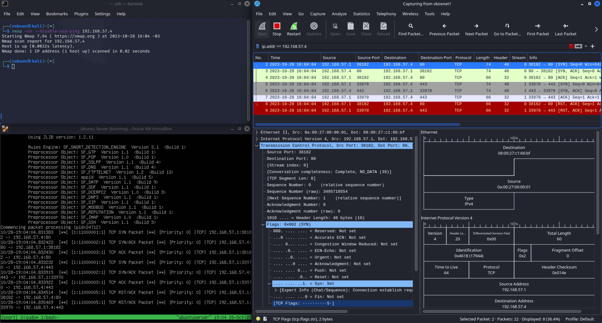
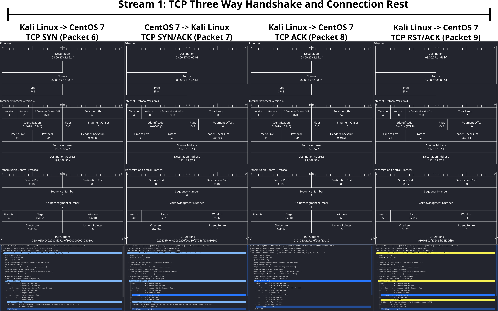

<div align="center">
<small><small>The upper image depicts the Nmap host discovery scan conducted without privileges, Snort set up in NIDS mode, and the packets captured with Wireshark. The lower image illustrates the diagram of the exchanged TCP packets.</small></small>
</div><br>

Without privileges, Snort successfully detected and Wireshark captured two TCP three-way handshakes followed by a reset, one for port 80 and the other for port 443, indicating the ports are open. Each handshake, along with its corresponding reset, consists of a TCP SYN, a TCP SYN/ACK, and a TCP ACK to establish the connection, followed by a TCP RST/ACK to terminate it.

</details>


## 1.2 - Port Scanning

Port scanning was conducted for both TCP and UDP protocols. In the case of TCP, ports 22 (open), 23 (closed), and 24 (firewall-filtered) were scanned using various methods. For the UDP protocol, scanning was done on ports 53 (DNS), 67 (DHCP), and 161 (SNMP).


<details>
<summary>
<h3>1.2.1 - TCP SYN scan</h3>
</summary>

The Nmap TCP SYN scan (`-sS` flag) is the default and most popular method for a reason. It's fast and stealthy, never completing TCP connections. Unlike other scans, like NULL/FIN/Xmas, Maimon, and idle scans, it works on any standard TCP setup, avoiding platform-specific quirks. This scan type offers a way to distinguish open, closed, and filtered states.

This technique is often known as half-open scanning because it doesn't open a full TCP connection. It sends a SYN packet, simulating a connection attempt, and watches for responses, such as:

- A SYN/ACK packet means the port is open.
- An RST/ACK packet shows the port is closed.
- If there's no response after retries, the port is labeled filtered.
- The port is also marked filtered if an ICMP unreachable error (type 3, code 0, 1, 2, 3, 9, 10, or 13) packet is received.
- The port also is considered open if a SYN packet (without the ACK flag) is received in response. It can be due to a rare TCP feature known as a simultaneous open or split handshake connection (see [link](https://nmap.org/misc/split‐handshake.pdf)).

Below are the Nmap command and the Snort rules used in the test displayed in the upcoming image. On Nmap, the `--max-rate` flag is set to one packet per second to give time to the victim machine to reply before the attack machine scans the next port, and the `-r` flag is to scan ports sequentially.

#### Nmap commands

```
sudo nmap -sS -p22,23,24 --max-rate 1 -r 192.168.57.4
```

#### Snort rules

```
alert tcp any any  <> 192.168.57.4 any (msg:"TCP SYN";     flags:S;   sid:11000001; rev:1;)
alert tcp any any  <> 192.168.57.4 any (msg:"TCP SYN/ACK"; flags:SA;  sid:11000002; rev:1;)
alert tcp any any  <> 192.168.57.4 any (msg:"TCP RST";     flags:R;   sid:11000004; rev:1;)
alert icmp any any <> 192.168.57.4 any (msg:"ICMP Destination Unreachable"; itype:3; sid:1000005; rev:1;)
```

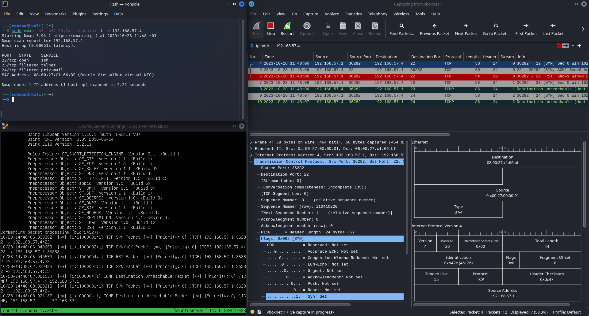
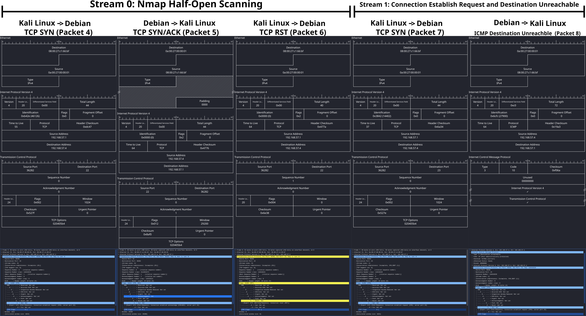

<div align="center">
<small><small>The image shows the Nmap TCP SYN scan (top left), Snort configured in NIDS mode (bottom left), Wireshark capturing the packets (middle left), and the diagram of the selected packets.</small></small>
</div><br>

- To port 22, which is open and not filtered by the firewall, Nmap sent a SYN package (No. 4), and the Target machine replied with a SYN-ACK package (No. 5) to establish the three-way handshake connection. However, Nmap replied with an RST package (N. 6), ending the handshake without completing it.
- To port 23, which is closed and not filtered by the firewall, Nmap sent a SYN package (No. 7), and the Target machine replied with an ICMP destination unreachable package (No. 8).
- To port 24, which is closed and filtered by the firewall, Nmap sent a SYN package (No. 9), and the Target machine replied with an ICMP destination unreachable package (No. 10).

</details>


<details>
<summary>
<h3>1.2.2 - TCP Connect Scan</h3>
</summary>

The Nmap TCP connect scan (`-sT` option) is the default when the SYN scan isn't available due to a lack of privileges for raw packets. Instead of writing raw packets, Nmap relies on the operating system to create connections using the connect system call. Rather than read raw packet responses off the wire, Nmap uses the Berkeley Sockets API to gather status information on each connection attempt.

When Nmap SYN scan is available, it is usually a better choice. Nmap has less control over the high-level connect call than with raw packets, making it less efficient. The system call completes connections to open target ports rather than performing the half-open reset that the SYN scan does. Not only does this take longer and require more packets to obtain the same information, but Target machines are more likely to log the connection.

Below are the Nmap command and the Snort rules used on the test. The image below shows the Attack machine terminal (top left), the terminal with Snort in NIDS mode (bottom left), the Wireshark showing the packets received/sent by the Target machine on ports 22, 23, and 24 (middle left) and the diagram of the chosen packets.

#### Nmap commands

```
sudo nmap -sT -p22,23,24 --max-rate 1 192.168.57.4
```

#### Snort rules

```
alert tcp any any  <> 192.168.57.4 any (msg:"TCP SYN";     flags:S;   sid:11000001; rev:1;)
alert tcp any any  <> 192.168.57.4 any (msg:"TCP SYN/ACK"; flags:SA;  sid:11000002; rev:1;)
alert tcp any any  <> 192.168.57.4 any (msg:"TCP ACK";     flags:A;   sid:11000003; rev:1;)
alert tcp any any  <> 192.168.57.4 any (msg:"TCP RST/ACK"; flags:RA;  sid:11000005; rev:1;)
alert icmp any any <> 192.168.57.4 any (msg:"ICMP Destination Unreachable"; itype:3; sid:1000005; rev:1;)
```


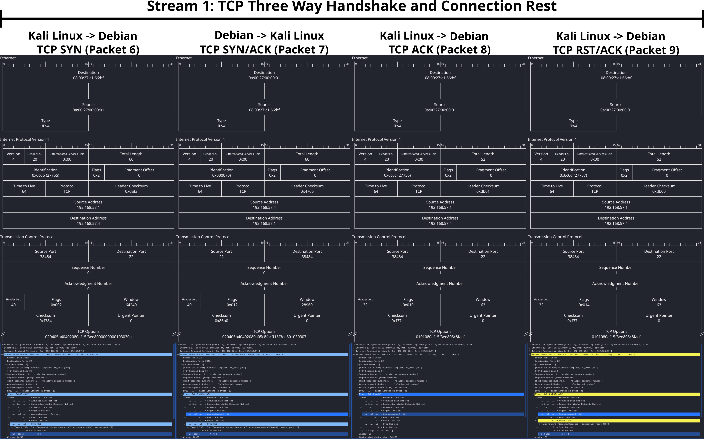
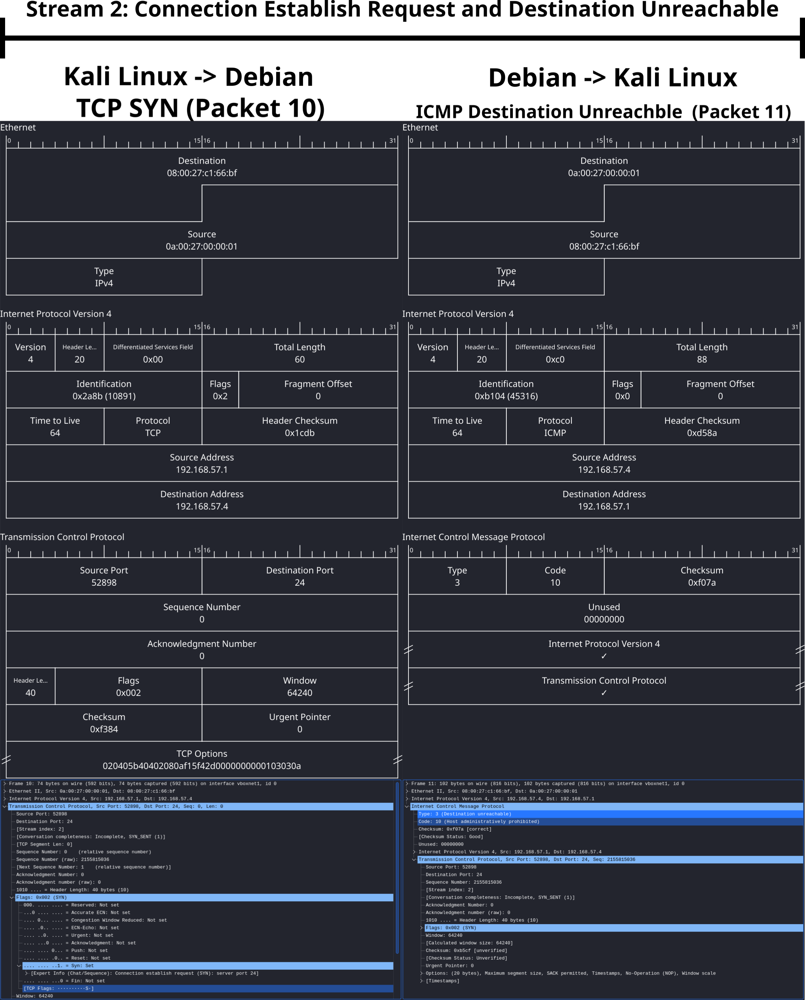

<div align="center">
<small><small>The image shows the Nmap TCP Connect scan (top left), Snort configured in NIDS mode (bottom left), Wireshark capturing the packets (middle left), and the diagram of the selected packets.</small></small>
</div><br>

- Nmap successfully established a connection to port 22, which was open and not filtered by the firewall. It sent a SYN packet, received a SYN-ACK packet in response, and then completed the three-way handshake by replying with an ACK packet. Following this, Nmap sent an RST-ACK packet to terminate the connection.
- Nmap sent a SYN packet to port 23, which was closed but not filtered by the firewall. In response, an ICMP destination unreachable message was received.
- Nmap sent a SYN packet to port 24 which was closed and filtered by the firewall. In response, an ICMP destination unreachable message was received.

</details>


<details>
<summary>
<h3>1.2.3 - Null Scan, FIN Scan, and Xmas Scan</h3>
</summary>

These three scan types exploit a subtle loophole in the TCP RFC to differentiate between open and closed ports. According to Page 65 of RFC 793, when the destination port's state is CLOSED, receiving an incoming segment lacking a Reset (RST) signal prompts the transmission of an RST in response. Next, it discusses packets that are sent to open and closed ports without the SYN, RST, or ACK bits set.

When scanning systems compliant with this RFC text, any packet not containing SYN, RST, or ACK bits will result in a returned RST if the port is closed and no response at all if the port is open. As long as none of those three bits are included, any combination of the other three (FIN, PSH, and URG) is OK. Nmap exploits this with three scan types:

- Null scan (`-sN`) Does not set any bits (TCP flag header is 0)
- FIN scan (`-sF`) Sets just the FIN bit.
- Xmas scan (`-sX`) Sets the FIN, PSH, and URG bits, lighting the packet up like a Christmas tree.

These three scan types have the same behavior except for the TCP flags set in probe packets. They expect to receive responses such as:

- If an RST packet is received, the port is considered closed.
- While no response means it is open|filtered.
- The port is marked filtered if an ICMP unreachable error (type 3, code 0, 1, 2, 3, 9, 10, or 13) is received.

#### Advantages

- The key advantage of these scan types is that they can sneak through certain non-stateful firewalls and packet-filtering routers.
- Another advantage is that these scan types are more stealthy than SYN scans, but most modern IDS products detect them.

#### Disadvantages

- The big downside is that not all systems follow RFC 793 to the letter. Several systems send RST responses to the probes regardless of whether the port is open or not. This causes all of the ports to be labeled closed. Major operating systems that do this are Microsoft Windows, many Cisco devices, BSDI, and IBM OS/400. This scan does work against most Unix-based systems though.
- Another downside of these scans is that they can't distinguish open ports from certain filtered ones, leaving you with the response open|filtered.

#### Nmap commands

```
sudo nmap -sN -p22 192.168.57.4
sudo nmap -sF -p22 192.168.57.4
sudo nmap -sX -p22 192.168.57.4
```

#### Snort rules

```
alert tcp any any <> 192.168.57.4 any (msg:"TCP NULL";      flags:0;   sif:11000012; rev:1;)
alert tcp any any <> 192.168.57.4 any (msg:"TCP FIN";       flags:F;   sif:11000007; rev:1;)
alert tcp any any <> 192.168.57.4 any (msg:"TCP XMAS Tree"; flags:FPU; sif:11000006; rev:1;)
```


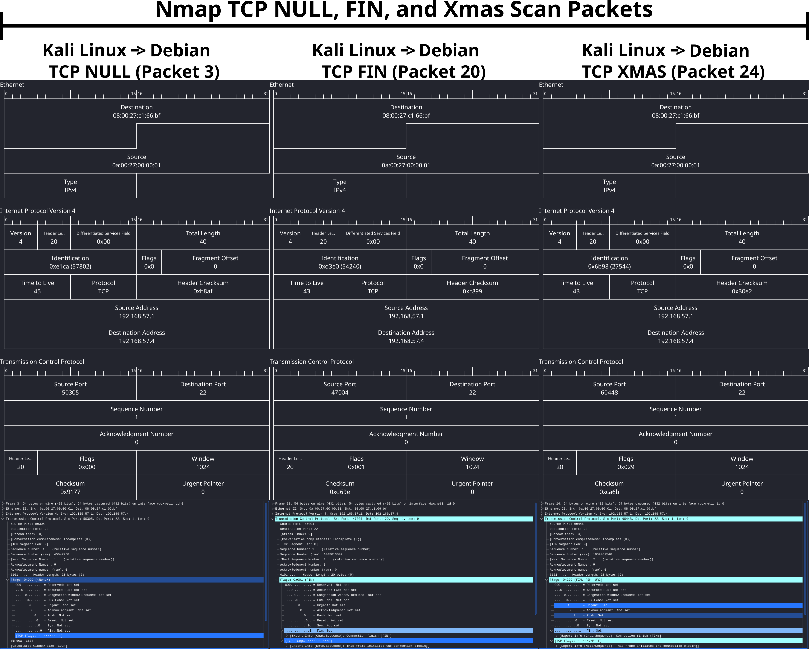

<div align="center">
<small><small>The image shows the Nmap TCP Null, FIN, Xmas scans (top left), Snort configured in NIDS mode (bottom left), Wireshark capturing the packets (middle left), and the diagram of the selected packets.</small></small>
</div><br>

No responses were received for the packets sent during all three scan types, which included TCP NULL, TCP FIN, and TCP XMAS Tree probes sent by their respective methods. This suggests that port 22 is either open or filtered by the firewall.

</details>


<details>
<summary>
<h3>1.2.4 - UDP Scan</h3>
</summary>

While most internet services work with TCP, UDP services are also widely deployed. Examples include DNS, DHCP, and SNMP (using ports 53, 67/68, and 161/162). Scanning UDP ports is slower and more complex than TCP, but Nmap can assist in probing UDP ports.

The port can be in the following states:

- **Closed port:** If an ICMP port unreachable error (type 3, code 3) is returned, the port is closed.
- **Filtered port:** Other ICMP unreachable errors (type 3, codes 0, 1, 2, 9, 10, or 13) mark the port as filtered.
- **Open port:** Occasionally, a service will respond with a UDP packet, proving that it is open.
- **open|filtered port**: If there's no reply after retries, the port is marked as open|filtered. This could indicate an open port or a packet filter blocking the communication.

#### Nmap commands

```
sudo nmap -sU -p53,67,161 --max-rate 1 -r 192.168.57.3
```

#### Snort rules

```
alert udp any any  <> 192.168.57.4 53  (msg:"UDP DNS";  sid:12000002; rev:1;)
alert udp any any  <> 192.168.57.4 67  (msg:"UDP DHCP"; sid:12000003; rev:1;)
alert udp any any  <> 192.168.57.4 161 (msg:"UDP SNMP"; sid:12000004; rev:1;)
alert icmp any any <> 192.168.57.4 any (msg:"ICMP Destination Unreachable"; itype:3; sid:1000005; rev:1;)
```


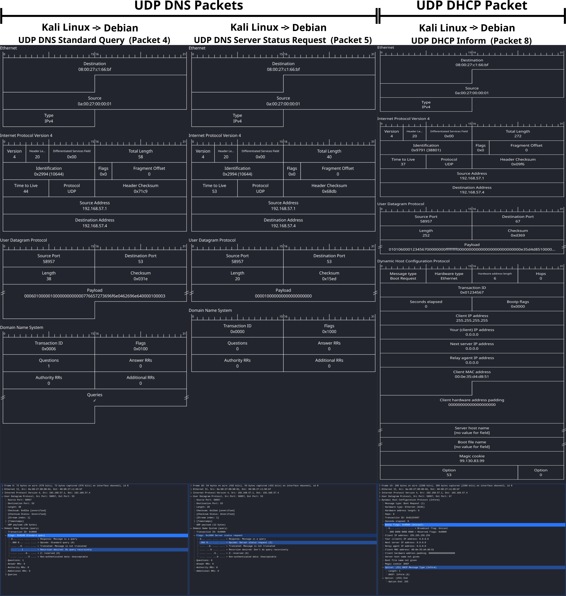


<div align="center">
<small><small>The image shows the Nmap UDP scan on ports 53, 67, and 161 (top left), Snort configured in NIDS mode (bottom left), Wireshark capturing the packets (middle left) and the diagram of the selected packets.</small></small>
</div><br>

The Snort detected two DNS packets, one DHCP, two SNMP packets sent by Nmap, and an ICMP destination unreachable packet response from the target for each packet sent by Nmap. Wireshark captured the same packets detected by Snort. The ICMP destination unreachable packets sent by the target had the type 3 and code 10 suggesting the ports were open|filtered, as indicated in the attacker terminal's Nmap output.

</details>


----------------------------------------------------------------------------------------------------


## 2 - SQL Injection Detection with Snort (TODO)

## 3 - Backdoor Attacks Detection with Snort (TODO)

## 4 - Rogue DHCP & Routing Attacks Detection with Snort (TODO)

## 5 - ICMP Redirect Attack Detection with Snor (TODO)


----------------------------------------------------------------------------------------------------


## Glossary

<details>
<summary>
<h3>Active Enumeration</h3>
</summary>

- **Host Discovery:** Host discovery is the process of identifying active devices on a computer network. It involves techniques such as ping sweeps, network scanning, and port probing to determine which IP addresses are currently in use and accessible, providing a map of the network's live hosts.
- **Port Scanning:** Port scanning is a technique used by network administrators and hackers to discover open ports on a computer or network device. It involves sending data packets to a range of ports on a target system to identify which ports are active and can establish a connection, providing crucial information about potential vulnerabilities and the services running on the target.

</details>


<details>
<summary>
<h3>Attacks Description</h3>
</summary>

- **SQL injection:** SQL injection is a common cyber attack where malicious code is inserted into SQL statements, allowing attackers to gain unauthorized access to a database. By manipulating input fields on a website, hackers can exploit vulnerabilities in poorly sanitized SQL queries. This can lead to unauthorized viewing, modification, or deletion of data, posing a significant security risk to websites and applications that use SQL databases. To prevent SQL injection, input validation, and parameterized queries are essential security measures.
- **Backdoor:** Backdoor attacks refer to unauthorized and hidden access points in a computer system or software application. Cybercriminals exploit these vulnerabilities to gain access, control, and manipulate the system without the user's knowledge. Backdoors can be intentionally created by developers for troubleshooting, but if misused or discovered by malicious actors, they pose significant security risks, allowing attackers to steal sensitive data, disrupt services, or install malware without detection. Protecting against backdoor attacks involves robust cybersecurity measures and regular system audits to identify and eliminate potential vulnerabilities.
- **Rogue DHCP:** Rogue DHCP (Dynamic Host Configuration Protocol) attacks occur when a malicious actor sets up a rogue DHCP server on a network without authorization. This server then assigns IP addresses and network configuration settings to unsuspecting devices, diverting traffic through the attacker's system. This can lead to various security risks, including interception of sensitive data, man-in-the-middle attacks, and network disruptions. Rogue DHCP attacks exploit the trust that devices place in DHCP servers, allowing attackers to gain unauthorized access to network traffic and compromise the integrity of the network. Protecting against such attacks involves implementing network security measures, such as DHCP snooping and port security, to detect and prevent rogue DHCP servers from operating on the network.
- **Rogue Routing:** Rogue Routing attacks, also known as route hijacking or BGP hijacking, occur when a malicious actor announces fake routing information on the internet. This misinformation deceives routers into diverting traffic through unauthorized paths. Attackers can intercept sensitive data, manipulate traffic, or disrupt services. These attacks exploit vulnerabilities in the Border Gateway Protocol (BGP), a protocol used for routing data between different networks. To mitigate Rogue Routing attacks, securing BGP configurations and implementing cryptographic solutions like Resource Public Key Infrastructure (RPKI) are essential.
- **ICMP Redirect:** ICMP Redirect attacks involve a malicious attacker sending falsified ICMP Redirect messages to a target host on a network. These messages deceive the host into rerouting its network traffic through an unauthorized gateway specified by the attacker. By manipulating the routing tables, the attacker can intercept, modify, or eavesdrop on the victim's data packets, leading to potential data theft, man-in-the-middle attacks, or network disruptions. ICMP Redirect attacks exploit the trust relationship between network devices, making them vulnerable to redirection instructions that appear to come from a legitimate source but are, in fact, maliciously crafted. Implementing proper network security measures, such as filtering ICMP Redirect messages and using secure routing protocols, can mitigate the risks associated with these attacks.

</details>


<details>
<summary>
<h3>Tools Description</h3>
</summary>

- **Kali Linux:** Kali Linux is a Debian-derived Linux distribution designed for digital forensics and penetration testing. It provides a vast array of tools and resources for cyber security professionals and enthusiasts, allowing them to assess and enhance the security of computer systems and networks. It is maintained and funded by Offensive Security.
- **Nmap:** Nmap (Network Mapper) is a free and open-source network exploration tool and security/port scanner. Nmap is used to discover hosts and open ports/services on a computer network by sending packets and analyzing the responses. Nmap provides several features for probing computer networks, including host and service discovery, service vulnerability identification, and operating system detection.
- **WPScan:** WPScan is an open-source WordPress security scanner developed by the WPScan Team. It helps users enumerate vulnerabilities within WordPress websites by scanning for plugins, themes, core files, and weak passwords, providing essential information to enhance site security and prevent potential attacks.
- **Burp Suite:** Burp Suite is a popular cyber security tool for web application security testing. It provides powerful features for finding security vulnerabilities in web applications, such as intercepting and modifying HTTP/S requests, scanning for various security issues like SQL injection and cross-site scripting, and analyzing the overall security posture of web applications.
- **sqlmap:** sqlmap is an open-source penetration testing tool that automates the detection and exploitation of SQL injection vulnerabilities in web applications. It helps security professionals and ethical hackers identify and exploit these vulnerabilities, allowing them to gain unauthorized access to databases and retrieve sensitive information. sqlmap supports a wide range of database management systems and is highly customizable, making it a powerful tool for testing web application security.
- **Empire:** Empire is a post-exploitation framework that allows cyber security professionals to maintain control over compromised systems. It provides a user-friendly interface for managing implants, allowing attackers to extract valuable information, escalate privileges, and execute various malicious actions on the target system, which makes it a potent tool in penetration testing and cyber security assessments.
- **Katana:** Katana Framework is an open-source security software that provides a platform for security professionals and ethical hackers to perform penetration testing, vulnerability assessments, and exploitation tasks. It offers a wide range of tools and resources, making it a versatile choice for cybersecurity experts aiming to assess and enhance the security of computer systems and networks.
- **Wireshark:** Wireshark is a GUI network protocol analyzer that allows users to capture and inspect data traveling back and forth on a computer network in real-time. It provides detailed information about network traffic (packets), helping users troubleshoot network issues, analyze security problems, and understand network communication patterns. Users can also load traffic data for analysis from a previously saved capture file. Wireshark's native capture file formats are pcapng format and pcap format.
- **SSH:** The Secure Shell Protocol is a cryptographic network protocol for operating network services securely over an unsecured network. Its most notable applications are remote login and command-line execution. SSH applications are based on a client-server architecture, connecting an SSH client instance with an SSH server.
SSH, or Secure Shell, is a cryptographic network protocol used to securely access and manage remote systems over an unsecured network. It provides a secure way to authenticate and encrypt data transmission between devices, commonly used for remote login, file transfers, and command-line execution on remote machines. SSH applications are based on a client-server architecture, connecting an SSH client instance with an SSH server.
- **VirtualBox:** Oracle VM VirtualBox is a type-2 hypervisor for x86 virtualization developed by Oracle Corporation suitable for enterprise as well as home use. It allows users to run multiple operating systems on a single machine simultaneously. It provides a virtual environment for running guest operating systems, making it ideal for testing software, running legacy applications, or experimenting with different operating systems without the need for separate hardware.
- **CentOS 7:** CentOS 7 is a Linux distribution known for its stability, security, and robust performance. It is based on the source code of Red Hat Enterprise Linux (RHEL) and provides a free, open-source, and community-supported alternative with enterprise-class features, making it a preferred choice for server environments and development purposes. CentOS stands for Community ENTerprise Operating System.
- **WordPress:** WordPress is a popular open-source content management system (CMS) that allows users to create and manage websites and blogs. It offers a user-friendly interface, customizable themes, and a wide range of plugins, making it accessible for beginners and powerful for developers.
- **Ubuntu Server:** Ubuntu Server is a variant of the standard Ubuntu designed for server environments and tailored for networks and services. It provides a stable and secure platform with a wide range of pre-installed software and excellent community support, making it a popular choice for hosting websites, applications, and services. It brings economic and technical scalability to your data center, public or private.
- **Tmux:** Tmux, short for Terminal Multiplexer, is a powerful command-line tool that allows users to split terminal windows into multiple panes, each capable of running its own shell session or command. It enables users to create and manage multiple terminal sessions within a single window, facilitating efficient multitasking and improving productivity for developers and system administrators. Tmux may be detached from a screen and continue running in the background, then later reattached.
- **Snort:** Snort is a free, open-source, and lightweight network intrusion detection system (IDS) and intrusion prevention system (IPS), capable of performing packet logging and real-time traffic analysis, detecting and alerting or preventing potential attacks on IP networks based on pre-defined rules. It employs a signature-based detection method by performing protocol analysis and content searching/matching to detect various attacks and probes, such as buffer overflows, stealth port scans, CGI attacks, SMB probes, OS fingerprinting attempts, and more. Snort has three primary uses:
    - Packet sniffer like tcpdump.
    - Packet logger (useful for network traffic debugging, etc).
    - Full-blown network intrusion detection system.

</details>

</div>
